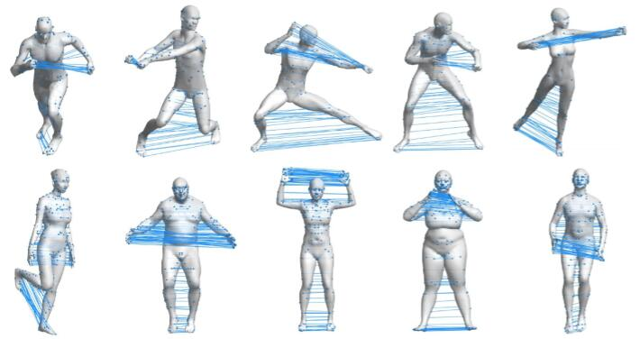

# Learning-based Intrinsic Reflectional Symmetry Detection
Jittor and matlab code of Learning-based Intrinsic Reflectional Symmetry Detection.



Reflectional symmetry is a ubiquitous pattern in nature. Previous works usually solve this problem by voting or sampling, suffering from high computational cost and randomness. In this paper, we propose a learning-based approach to intrinsic reflectional symmetry detection. Instead of directly finding symmetric point pairs, we parametrize this self-isometry using a functional map matrix, which can be easily computed given the signs of Laplacian eigenfunctions under the symmetric mapping. Therefore, we manually label the eigenfunction signs for a variety of shapes and train a novel neural network to predict the sign of each eigenfunction under symmetry. Our network aims at learning the global property of functions and consequently converts the problem defined on the manifold to the functional domain. By disentangling the prediction of the matrix into separated bases, our method generalizes well to new shapes and is invariant under perturbation of eigenfunctions. Through extensive experiments, we demonstrate the robustness of our method in challenging cases, including different topology and incomplete shapes with holes. By avoiding random sampling, our learning-based algorithm is over 20 times faster than state-of-the-art methods, and meanwhile, is more robust, achieving higher correspondence accuracy in commonly used metrics.

## Usage

  1. Clone this repo.
   ```
   git clone https://github.com/IGLICT/intrinsicSym-Jittor.git
   ```

  2. Set up python3 virtual environment.
   ```
   virtualenv --system-site-packages -p python3 ./env-intrinsym
   source ./env-intrinsym/bin/activate
   cd ./instrinsym
   pip install -r requirements.txt
   ```

  3. Install Jittor, you can refer to the [official repo of Jittor](https://github.com/Jittor/jittor).


  4. Use the network to predict intrinsic symmetry.
   ```
   cd ./network
   python predict.py
   ```
   or train this network
   ```
   python train.py
   ```

  5. Run the scripts (./intrinsym/scripts) for visualization, annotation, or preprocessing with matlab
   ```
   main_visualize_ss   % visualize
   main_selecct_eigen  % annotate
   main_compute_evecs  % preprocess
   ```
## Citation

If you find our work useful in your research, please consider citing:

    @article{qiao2022,
      author={Qiao, Yi-Ling and Gao, Lin and Liu, Shu-Zhi and Liu, Ligang and Lai, Yu-Kun and Chen, Xilin},
      journal={IEEE Transactions on Visualization and Computer Graphics}, 
      title={Learning-based Intrinsic Reflectional Symmetry Detection}, 
      year={2022},
      volume={},
      number={},
      pages={1-1},
      doi={10.1109/TVCG.2022.3172361}}
    
    @article{hu2020jittor,
      title={Jittor: a novel deep learning framework with meta-operators and unified graph execution},
      author={Hu, Shi-Min and Liang, Dun and Yang, Guo-Ye and Yang, Guo-Wei and Zhou, Wen-Yang},
      journal={Science China Information Sciences},
      volume={63},
      number={222103},
      pages={1--21},
      year={2020}
    }
